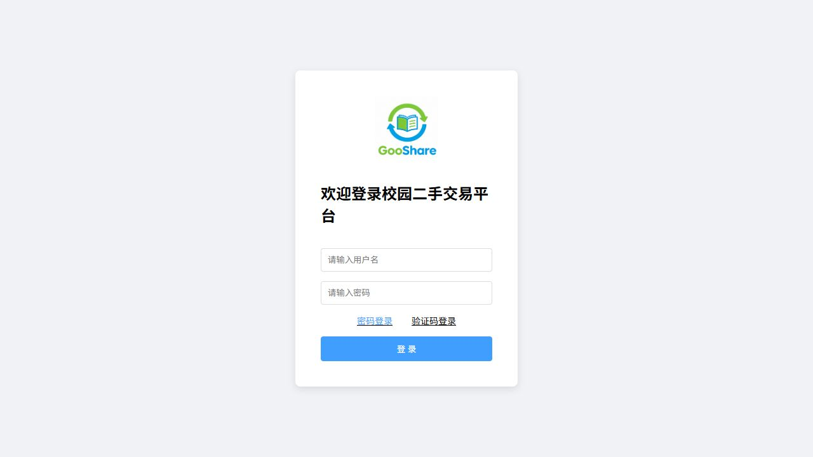
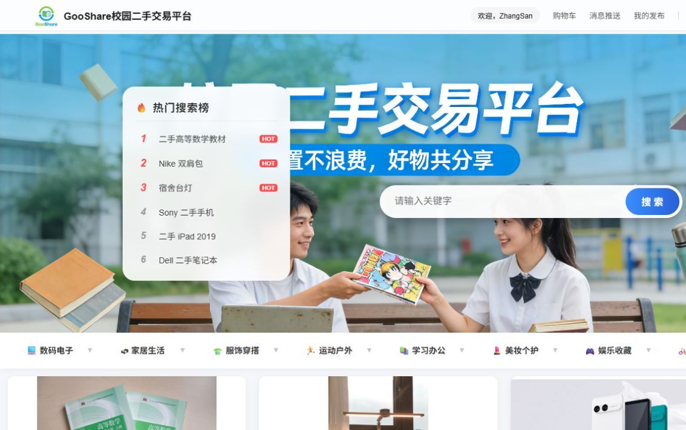
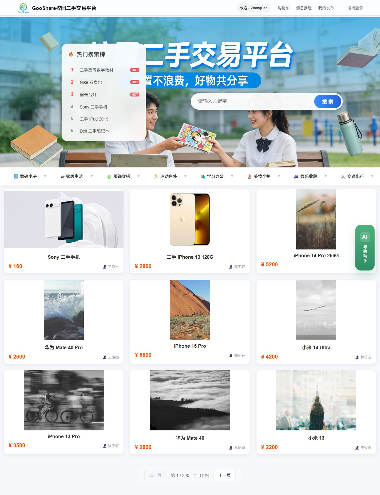
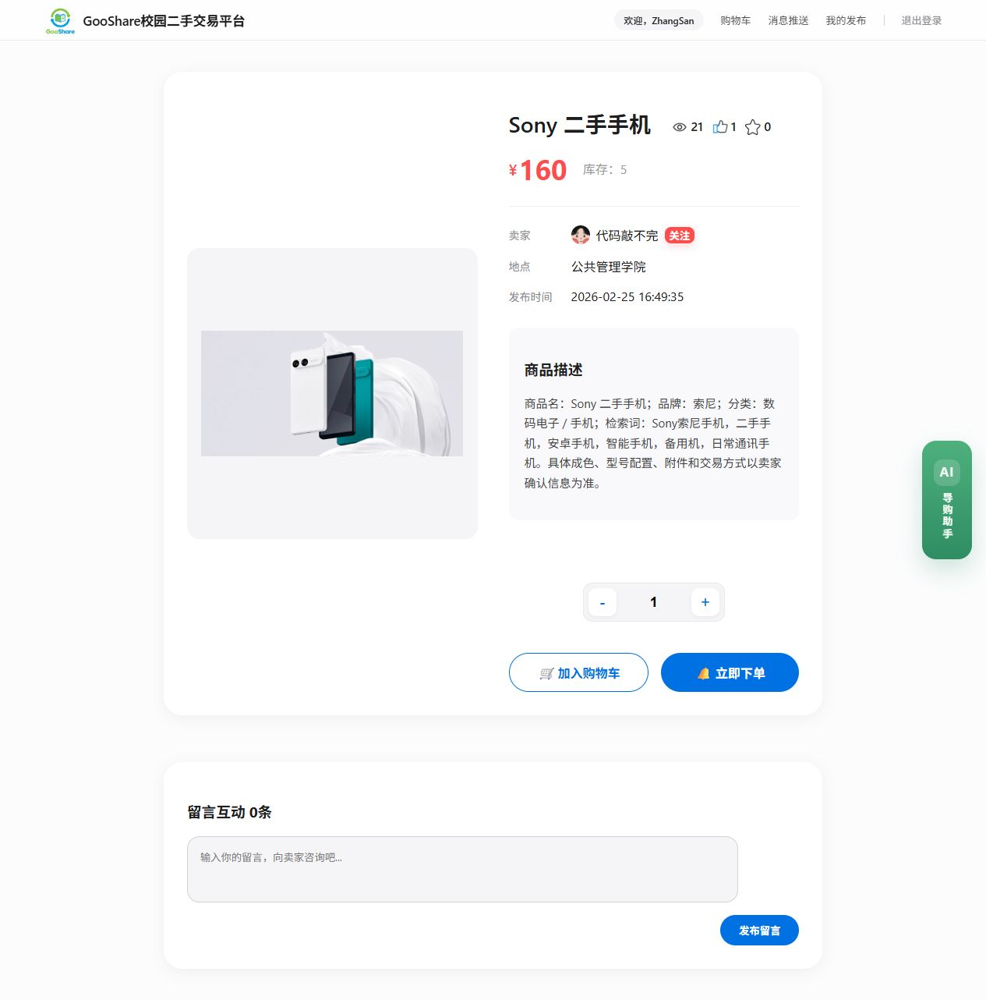
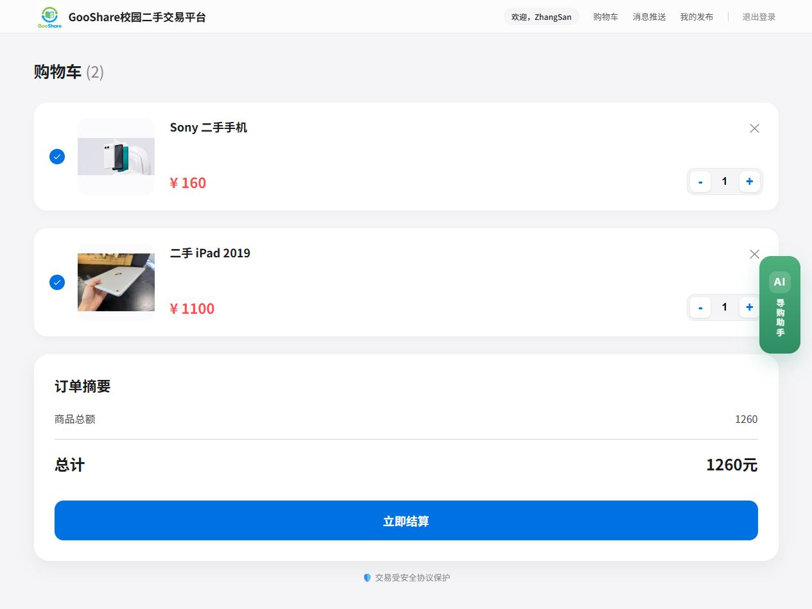
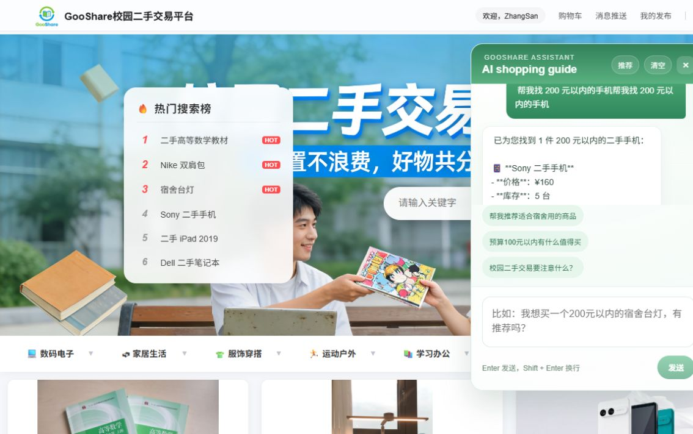
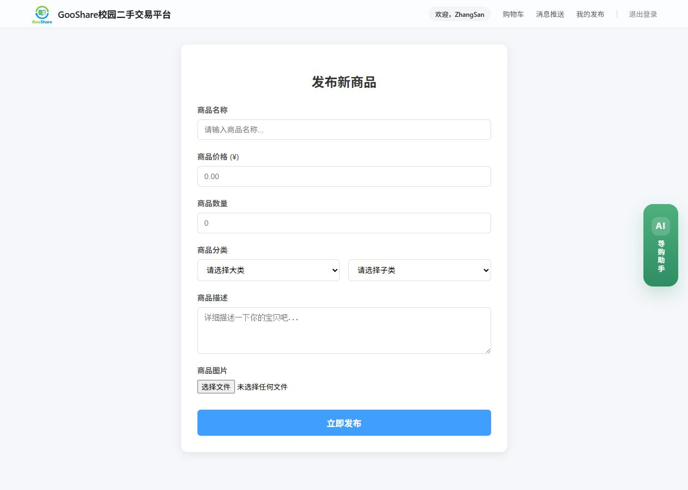
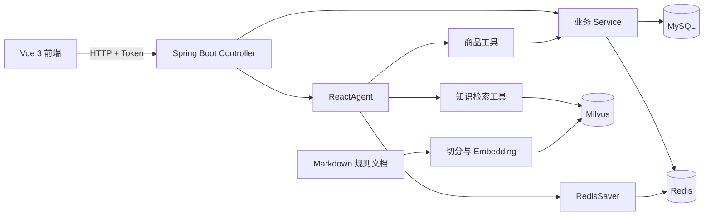

# GooShare 校园二手交易平台

GooShare 是一个前后端分离的校园二手交易项目，覆盖登录、商品检索与发布、购物车、订单、关注、评论、消息通知和优惠券秒杀等业务，并在此基础上实现了一个基于 **Spring AI Alibaba ReactAgent** 的 AI 导购助手。

AI 助手不会直接生成商品事实，而是通过受控工具查询 MySQL 中的真实商品数据；平台规则问答采用 DashScope Embedding 与 Milvus 构建 RAG 知识库，并通过元数据过滤、来源引用和自动评测降低幻觉风险。

> 当前仓库主要用于学习、作品展示和面试交流，尚未按生产环境标准完成完整的数据迁移、监控与部署体系。

## 核心功能

| 模块 | 已实现能力 |
| --- | --- |
| 用户认证 | 密码登录、手机验证码登录、Redis Token 会话、双层拦截器鉴权与续期 |
| 商品系统 | 商品检索、分类筛选、详情、发布、图片上传、点赞、收藏、浏览与热度排行 |
| 交易功能 | 购物车、库存校验、订单创建、关注、评论与消息通知 |
| 秒杀 | Lua 原子校验库存与一人一单、Redis Stream 异步订单处理、数据库条件更新 |
| AI 导购 | ReactAgent 自动选择商品搜索、分类、详情和平台知识工具 |
| RAG 知识库 | Markdown 切分、DashScope Embedding、Milvus 向量召回、元数据过滤和来源引用 |
| 对话记忆 | RedisSaver 持久化 Agent 检查点，以 `userId + conversationId` 隔离用户和会话 |
| Agent 评测 | 知识召回、回答事实性、来源引用、禁止关键词和记忆隔离测试 |

## 项目截图

### 用户登录

支持用户名密码与手机验证码两种登录方式，登录后由 Redis Token 维护会话状态。



### 登录后的商品首页

首页展示真实商品列表、热度榜、分类筛选与登录用户信息。



### 商品分类筛选

按数码电子、家居生活、学习办公等分类筛选商品，示例展示手机分类结果与分页数据。



### 商品详情与交易入口

详情页展示价格、库存、卖家、浏览与互动数据，并提供关注、购物车和下单入口。



### 购物车与订单摘要

购物车支持多商品勾选、数量调整和实时金额汇总，并在结算前展示订单摘要。



### AI 导购助手

用户通过自然语言描述预算和商品需求，ReactAgent 调用商品检索工具并基于数据库结果回答。



### 商品发布

卖家可以填写商品名称、价格、库存、分类和描述，并上传商品图片。



## 系统架构



Agent 的主要执行链路：

```text
用户问题
  → ReactAgent 判断是否需要工具
  → 商品问题查询 MySQL / 规则问题检索 Milvus
  → 基于真实结果组织回答
  → RedisSaver 保存本轮会话状态
```

## Agent 设计

### 受控工具调用

当前注册的工具包括：

- 商品搜索：解析关键词、品牌、分类、价格区间和排序方式后查询数据库。
- 分类查询：获取平台真实的一级、二级分类。
- 商品详情：按商品 ID 查询价格、库存、卖家等信息。
- 平台知识：按知识类型检索交易规则、安全指南与物流说明。

工具参数使用结构化 DTO 描述，Java 层负责参数校验、名称到数据库 ID 的转换以及结果数量限制，避免让模型直接执行 SQL。

### RAG 知识库

知识文件位于 `backend/src/main/resources/knowledge/`：

- `platform-rules.md`
- `campus-trade.md`
- `shipping.md`

导入流程会将文档切分为片段，为每个片段生成稳定 ID，并写入以下元数据：

- `source`：知识来源文件名。
- `knowledgeType`：平台规则、校园面交或物流知识。
- `chunkIndex`：片段序号。

检索时先根据 `knowledgeType` 过滤检索范围，再执行 Top-K 向量召回。Agent 回答规则问题时必须引用 `source`，知识库没有明确依据时应回答“当前知识库没有明确收录”，不得使用常识补全平台规则。

### 会话隔离

Agent 使用 RedisSaver 保存对话检查点，线程标识格式为：

```text
user:{userId}:conversationId:{conversationId}
```

因此：

- 相同用户、相同 `conversationId` 可以恢复多轮上下文。
- 相同用户的不同会话相互隔离。
- 不同用户即使提交相同 `conversationId` 也不会共享记忆。

## 技术栈

### 后端

- Java 21
- Spring Boot 3.5.8
- Spring AI Alibaba Agent Framework 1.1.2.0
- Spring AI Alibaba DashScope
- MyBatis / MyBatis-Plus
- MySQL
- Redis / Redisson / Redis Stream / Lua
- Milvus Vector Store
- Aliyun OSS
- Springdoc OpenAPI
- JUnit 5 / Mockito

### 前端

- Vue 3
- Vue Router 4
- Axios / Fetch API
- Vue CLI 5

### 基础设施

- Docker Desktop / Docker Compose
- Milvus 2.5.27
- MinIO
- etcd

## 目录结构

```text
gooshare-agent-marketplace/
├─ backend/
│  ├─ db/                         # 数据修复与清理脚本
│  ├─ deploy/milvus/              # Milvus、MinIO、etcd Compose 配置
│  ├─ src/main/java/com/gooshare/
│  │  ├─ agent/                   # Agent DTO、RAG 导入与工具
│  │  ├─ config/                  # Web、Agent、记忆和模型配置
│  │  ├─ controller/              # HTTP 接口
│  │  ├─ entity/                  # 持久化实体
│  │  ├─ mapper/                  # MyBatis Mapper
│  │  ├─ service/impl/            # 业务服务实现
│  │  └─ ...
│  ├─ src/main/resources/
│  │  ├─ knowledge/               # RAG 知识文档
│  │  ├─ scripts/seckill.lua      # 秒杀原子校验脚本
│  │  └─ application.yml
│  └─ src/test/java/              # 单元测试与 Agent 集成评测
├─ frontend/                      # Vue 3 前端
├─ docs/                          # 补充文档
├─ .env.example                   # 后端与基础设施配置示例
└─ README.md
```

## 本地运行

### 1. 环境要求

| 依赖 | 建议版本或要求 |
| --- | --- |
| JDK | 21 |
| Node.js | 18 或更高版本 |
| MySQL | 8.x |
| Redis | 6.x 或更高版本 |
| Docker Desktop | 支持 Docker Compose V2 |
| DashScope | 可用的 API Key |

当前仓库尚未包含完整的数据库建表与初始化数据脚本。运行前需要准备与 Mapper 对应的 GooShare 数据库结构和必要的测试数据。

### 2. 配置环境变量

复制根目录示例文件：

```powershell
Copy-Item .env.example .env
```

至少需要配置：

```dotenv
DB_URL=jdbc:mysql://localhost:3306/gooshare
DB_USERNAME=your-database-user
DB_PASSWORD=your-database-password

AI_DASHSCOPE_API_KEY=your-dashscope-api-key

ALIYUN_OSS_ENDPOINT=your-oss-endpoint
ALIYUN_OSS_ACCESS_KEY_ID=your-access-key-id
ALIYUN_OSS_ACCESS_KEY_SECRET=your-access-key-secret
ALIYUN_OSS_BUCKET_NAME=your-bucket-name

MINIO_ACCESS_KEY=your-minio-user
MINIO_SECRET_KEY=your-strong-minio-password
```

`.env` 已被 Git 忽略，禁止把真实密码或密钥写入 `.env.example`、`application.yml` 或前端代码。

注意：Spring Boot 不会自动读取仓库根目录的 `.env`。启动后端前，请将这些变量配置到 IDEA Run Configuration，或者在当前 PowerShell 会话中使用 `$env:变量名="值"` 设置。

### 3. 启动 Milvus

在仓库根目录执行：

```powershell
docker compose --env-file .env -f backend/deploy/milvus/docker-compose.yml up -d
docker compose --env-file .env -f backend/deploy/milvus/docker-compose.yml ps
```

默认端口：

- Milvus gRPC：`19530`
- Milvus WebUI：`http://localhost:9091/webui/`
- MinIO API：`9000`
- MinIO Console：`http://localhost:9001`

MinIO 服务和 Milvus 客户端必须使用相同的访问凭据；Compose 文件已将 `MINIO_ACCESS_KEY`、`MINIO_SECRET_KEY` 同步传入两边。

### 4. 首次导入知识库

确认 Milvus 与 DashScope 配置可用后，在启动后端前临时开启知识库重建：

```powershell
$env:GOOSHARE_RAG_REBUILD_ON_STARTUP="true"
Set-Location backend
.\mvnw.cmd spring-boot:run
```

日志出现“知识库重建完成”后，停止应用并恢复常规配置：

```powershell
$env:GOOSHARE_RAG_REBUILD_ON_STARTUP="false"
```

平时运行保持 `false`，避免每次启动重复调用 Embedding 服务。

### 5. 启动后端

确保 MySQL、Redis 和 Milvus 已启动，并且当前终端或 IDEA 已配置所需环境变量：

```powershell
Set-Location backend
.\mvnw.cmd spring-boot:run
```

后端默认地址：`http://localhost:8084`

Swagger UI：`http://localhost:8084/swagger-ui/index.html`

### 6. 启动前端

前端只需要配置后端地址，不应该保存模型或云服务密钥：

```powershell
Set-Location frontend
Copy-Item .env.example .env.local
npm ci
npm run serve
```

默认 API 地址为 `http://localhost:8084`，可以在 `frontend/.env.local` 中修改：

```dotenv
VUE_APP_API_BASE_URL=http://localhost:8084
```

## AI 接口示例

`POST /ai/chat-v2` 需要登录。先通过密码或验证码登录获得 Token，再将 Token 放入 `Authorization` 请求头。

```http
POST http://localhost:8084/ai/chat-v2
Content-Type: application/json
Authorization: your-login-token

{
  "conversationId": "demo-conversation-001",
  "message": "帮我找 2000 元以下的手机"
}
```

成功响应示例：

```json
{
  "code": 200,
  "msg": "success",
  "data": {
    "conversationId": "demo-conversation-001",
    "answer": "根据商品工具返回的数据生成的回答"
  }
}
```

第一次请求可以不传 `conversationId`，后端会自动生成并在响应中返回。后续请求复用该 ID，即可延续同一会话。

## 测试与 Agent 评测

### 购物车单元测试

```powershell
Set-Location backend
.\mvnw.cmd "-Dtest=CartServiceImplTest" test
```

该测试覆盖数量为 0、库存为 0、累计数量超过库存以及正常加入购物车等场景。

### 知识召回评测

```powershell
.\mvnw.cmd "-Dtest=KnowledgeRetrievalEvaluationIT" test
```

检查召回文档来源、知识类型过滤和无关知识控制。

### Agent 回答评测

```powershell
.\mvnw.cmd "-Dtest=AgentAnswerEvaluationIT" test
```

检查回答是否命中预期关键词、是否包含禁止结论，以及是否引用正确知识来源。

### 记忆隔离评测

```powershell
.\mvnw.cmd "-Dtest=AgentMemoryIsolationEvaluationIT" test
```

检查不同 `threadId`、用户和会话之间是否发生记忆串扰。

集成评测会真实连接 Redis、Milvus 和 DashScope，运行前请确保相关服务及环境变量可用，并保持：

```text
gooshare.rag.rebuild-on-startup=false
```

## 构建

后端：

```powershell
Set-Location backend
.\mvnw.cmd -DskipTests package
```

前端：

```powershell
Set-Location frontend
npm ci
npm run build
```

构建产物、依赖目录、日志、Milvus 数据和本地环境文件均已加入 `.gitignore`。

## 当前限制

- 尚未提供完整的数据库 Schema 和初始化数据迁移脚本。
- Dify 相关代码属于早期实验入口，当前 Agent 主链路使用 Spring AI Alibaba 与 DashScope。
- RAG 知识内容目前由三份 Markdown 文档组成，覆盖范围仍可继续扩展。
- 项目尚未接入 CI/CD、统一监控和生产级密钥管理。
- 平台当前不应被视为提供物流、支付托管或售后仲裁能力，具体规则以知识库文档为准。

## 后续计划

- 补充完整、可重复执行的数据库迁移脚本。
- 为后端、前端和基础设施增加统一容器编排。
- 在 CI 中运行单元测试、静态检查和无需外部模型的离线评测。
- 扩充 Agent 工具、知识库和评测数据集。
- 增加首页推荐问题和个性化商品推荐。

## 安全说明

- 不要提交 `.env`、`application-local.yml` 或任何真实密钥。
- DashScope、OSS、Dify、数据库和 MinIO 凭据只能存放在本地环境变量或安全的密钥管理服务中。
- 前端环境变量会进入浏览器构建产物，禁止使用 `VUE_APP_` 保存服务端密钥。
- 如果密钥曾经进入 Git 历史，仅删除当前文件不够，还应立即轮换密钥并清理历史记录。
